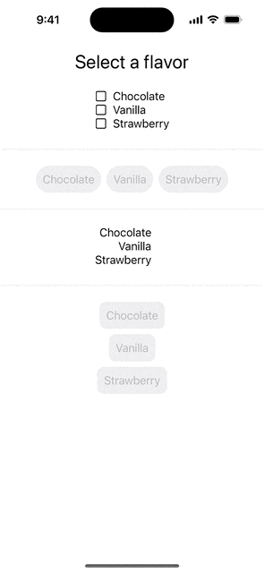

# RadioGroup

A package to create generic radio group controls in SwiftUI using static member lookup.

## Usage
Initializers are provided for `Sequence`s of `Identifiable` elements
```
RadioGroup(items: numbers, selection: $selection) { item, isSelected in
    Text("Item: \(item.value)")
        .padding()
        .background(isSelected ? Color.blue : Color.gray)
        .cornerRadius(8)
}
```
and for `Sequence`s with `Element`s where there is a `Hashable` `KeyPath`
```
RadioGroup(items: (1...5), id: \.self, selection: $selection) { item, isSelected in
    Text("Item: \(item.value)")
        .padding()
        .background(isSelected ? Color.blue : Color.gray)
        .cornerRadius(8)
}
```
Initializers are also provided where the `Element`s are `CustomStringConvertible` or a `String` transform is provided.  In these cases the styling for the items in the group will be provided by the `.radioGroupStyle` `EnvironmentValue`.
```
RadioGroup(flavors, id:\.self, selection: $selectedFlavor).radioGroupStyle(.roundedRect())
```

## Custom styles
Create custom styles by extending the `RadioGroupStyle` `protocol`.  Two example conformances are provided `ButtonRadioGroupStyle` and `AccessoryImageRadioGroupStyle`. 

## Preview

